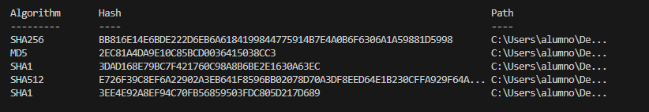
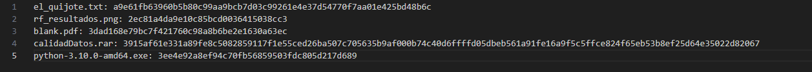

# **Sumas de verificación.**

Big data aplicado.  
Álvaro Martínez Lineros  
\# Ejercicio: Verificación de Integridad de Archivos con Hashes  
\#  
\# Descripción:  
\# En esta práctica, implementarás un sistema de sumas de verificación utilizando distintos métodos de cifrado de la librería hashlib en Python.  
\# Deberás calcular, guardar y verificar hashes de archivos para comprobar su integridad.  
\#Requisitos:  
\# Crear un script en Python que realice las siguientes tareas:  
\# Calcular el hash SHA-256 de un archivo de texto (archivo.txt).  
\# Calcular el hash MD5 de una imagen (imagen.jpg).  
\#Calcular el hash SHA-1 de un archivo PDF (documento.pdf).  
\#Calcular el hash SHA-512 de un archivo ZIP (comprimido.zip)  
\# Calcular el hash SHA-1 de un archivo EXE (ejecutable.exe)  
\#Guardar los hashes calculados en un archivo de texto llamado hashes.txt, donde cada línea contenga el \#nombre del archivo seguido de su respectivo hash.  
\#Implementar una función que permita verificar la integridad de un archivo comparando su hash actual \#con un hash previamente calculado y almacenado en hashes.txt.  
\#Probar la función de verificación con los archivos proporcionados y mostrar un mensaje que indique si \#el archivo ha sido modificado o no.  
\#  
\# Instrucciones:  
\# 1\. Selecciona cada archivo en tu pc.  
\# 2\. Ingresa un algoritmo de hash (md5, sha1, sha256, sha512).  
\# 3\. Genera y almacena el hash del archivo en un archivo de texto.  
\# 4\. Verifica la integridad del archivo comparándolo con su hash.  
\# 5\. Modifica el archivo original y vuelve a ejecutar la verificación para observar los resultados.  
\# 6\. Documenta tu proceso con capturas de pantalla y explica los resultados obtenidos.

# **Hash originales.**

# **Modificación de archivos.**

Se ha añadido información en “el\_quijote.txt” y “calidadDatos.rar”. Aquí podemos ver como quedan las nuevas sumas de verificación:

# **Conclusiones.**

El hash o suma de verificación de un archivo cambia con cada modificación porque las funciones hash están explícitamente hechas para ser sensibles al mínimo cambio en el archivo. Esto los hace muy útiles para controlar y verificar cambios en los archivos.