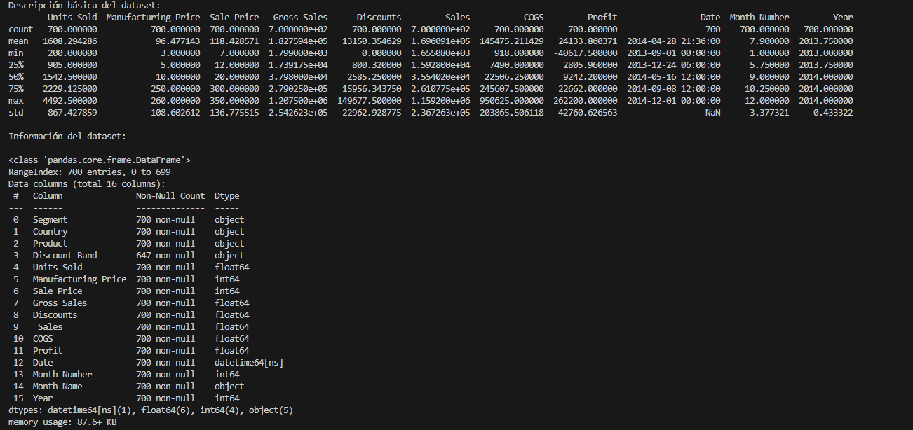
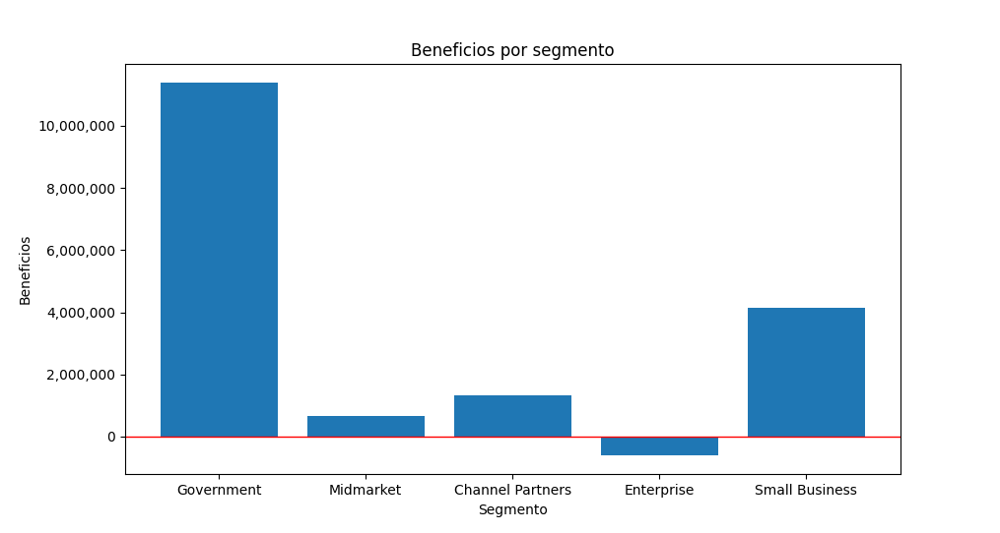
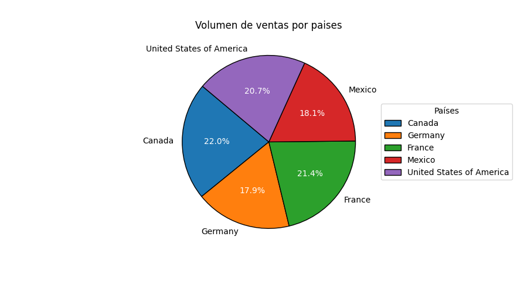
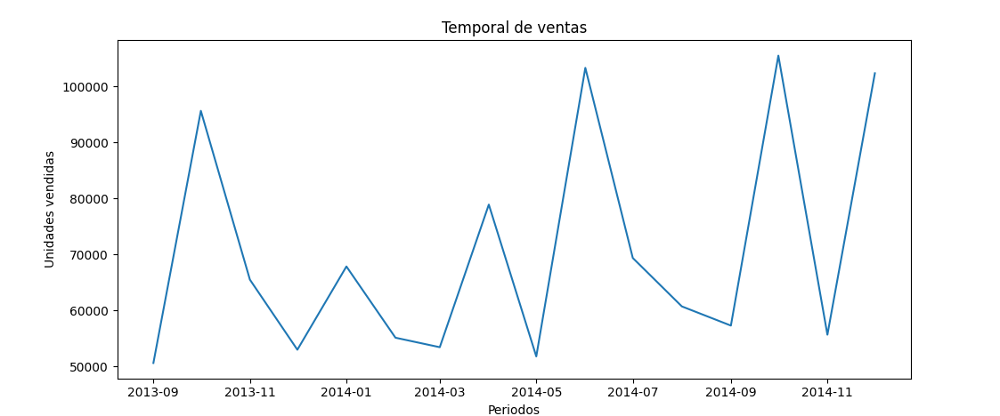
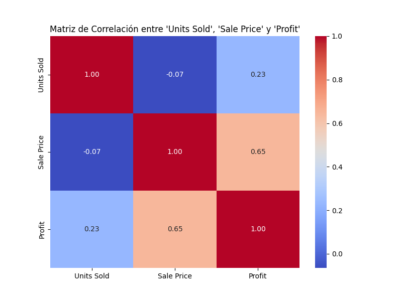
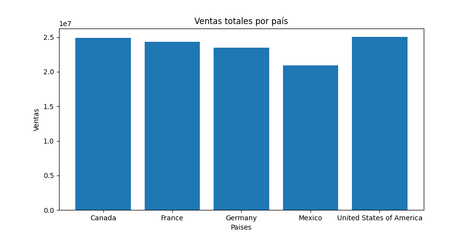

# Análisis Financiero
### Sistemas de Big Data
#### Alvaro Martínez Lineros

## 1. Exploración inicial del dataset.
Se ha realizado la carga del dataset en formato Dataframe de pandas para facilitar el manejo. Con los comandos `data.describe()` y `data.info()` podemos observar unas métricas básicas del dataframe, tipos de datos de las columnas, contador de valores nulos, tamaño y nombre de las columnas.

## 2. Análisis descriptivo.
Con la información obtenida gracias al `data.describe()` podemos ver las métricas de cada columna.

Como valores a destacar de este primer análisis podemos ver como en algún momento no se obtuvieron beneficios, pues el mínimo es negativo `-40617.5000` y la desviación típica es `42760.626`. 

Los registros van de `2013-09-01` al `2014-12-01`, ese es el periodo de las ventas de este dataset.

## 3. Segmentación por categorías.
Si visualizamos los beneficios por los segmentos, podemos observar como en el segmento "Enterprise" se han tenido pérdidas y el segmento "Goverment" el que más beneficios ha tenido con diferencia.

## 4. Análisis por país.
El país con mayor volumen de ventas es Canadá con el 22% y el país con el menor volumen es Alemania con el 17.9%.

## 5. Análisis temporal.

Se puede observar el temporal de las ventas en los últimos años (2013-2014) por meses. El gráfico muestra un patrón de subidas en el inicio del verano y el inicio del otoño (junio y octubre), recayendo los meses siguientes drásticamente.

## 6. Análisis de productos

Con el siguiente gráfico podemos observar que el producto que más beneficios totales que ha generado son los paseos, y el menor la carretera.

## 7. Análisis de descuentos

Con el siguiente gráfico podemos observar que se realizan más ventas con un mayor descuento, otorgando mayores beneficios.

## 8. Análisis de correlación

La matriz de correlación nos muestra como el profit y el sale price está altamente relacionado.

## 9. Visualización de datos

La matriz de correlación nos muestra como el profit y el sale price está altamente relacionado.

## 10. Conclusiones
Mejorar la relación con el segmento "Enterprise" y aprovechar la rentabilidad del segmento "Government".
Aumentar las ventas en mercados con menor penetración como Alemania, y reforzar la fidelización en Canadá.
Aprovechar los picos estacionales de ventas en junio y octubre mediante promociones específicas.
Optimizar la estrategia de descuentos para mantener un equilibrio entre ventas y rentabilidad.
Centrarse en la promoción de productos rentables y revisar el rendimiento de productos de bajo margen.
Explorar ajustes de precios de productos con alta demanda para mejorar los márgenes de beneficio.
